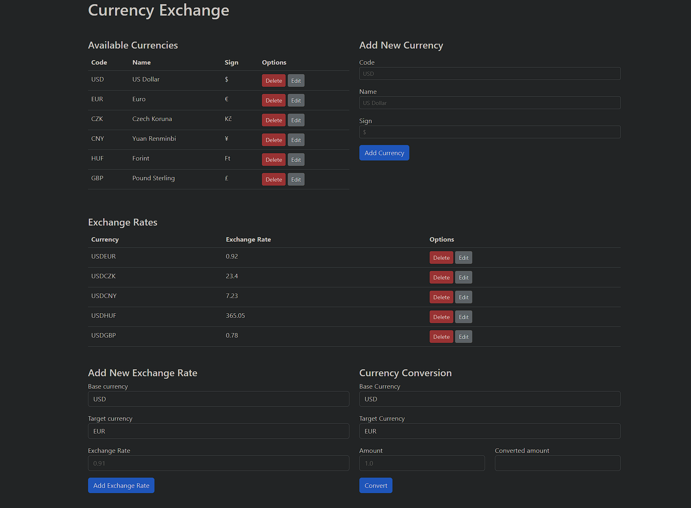

# Currency Exchange REST API
## Overview
#### This project implements a REST API for managing currencies and exchange rates, allowing users to view, add, update, delete currencies, and calculate currency conversions.

## Project Motivation
#### This project aims to:
- **Demonstrate the principles of MVC architecture**
- **Demonstrate best practices for REST API design** (correct resource naming and HTTP response code usage)
- **Cover basic SQL syntax and table creation**

## Key Features
- **Manage Currencies**: Add, update, delete currencies, and view a list of all available currencies.
- **Manage Exchange Rates**: Add, update, delete exchange rates, and retrieve existing ones.
- **Calculate Currency Conversion**: Calculate conversion amounts from one currency to another based on the current exchange rate.

## Technologies Used
- **Java**: Core language for development.
- **Maven**: Dependency management and build tool.
- **Jakarta servlet API (6.1.0)**: For handling HTTP requests.
- **PostgreSQL**: Database management system.
- **Flyway**: Database migration tool.
- **Docker & Docker Compose**: For containerized deployment.
- **Tomcat 10+**: Local server for running the application.
- **Lombok**: Reduces boilerplate code by auto-generating getters, setters, and other common methods.
- **Object mapper**: For JSON response formatting.
- **HTML, CSS, JS**: For the test front-end.

## Local Deployment
1. **Clone the repository:**
```bash
git clone https://github.com/kekock/java-currency-exchange.git
```
2. **Open the project in IntelliJ IDEA.**
3. **Configure Tomcat:**
   - In IDEA, go to Run > Edit Configurations.
   - Add a new Tomcat configuration.
   - Set the deployment option to use WAR exploded artifact.
   - Ensure that the application is set to run on localhost:8080.

   
4. **Set up Docker Compose:**
   > _**Note:** Ensure you have Docker installed on your device._
   - In IDEA, navigate to the Docker tab and start your Docker containers.
   
   
   - Alternatively, you can run the following command in your terminal:
```bash
docker-compose up
```
5. **Run the project:**
   - Start Tomcat from IDEA by running the configured Tomcat server.

   
6. **Access the API:**
   - Once Tomcat is up and running, the API will be available at:
```bash
http://localhost:8080/
```

## Front-End Overview

#### The front end of this project is designed to provide a user-friendly interface for interacting with the Currency Exchange REST API. It allows users to perform the following actions:

- **View Currencies:** Users can see a list of all available currencies, including their code, name, and sign.
- **Delete Currency:** Users can delete a currency that is no longer needed via a "Delete" button next to each currency.
- **Update Currency:** Users can update existing currency details using the "Edit" button in the Options column.
- **Add Currencies:** A form allows users to add new currencies by entering the code, name, and sign.
- **View Exchange Rates:** Users can view all available exchange rates in a table.
- **Delete Exchange Rate:** Users can delete an exchange rate via a "Delete" button next to each rate.
- **Update Exchange Rate:** Users can update exchange rates via the "Edit" button next to each entry.
- **Add Exchange Rate:** Users can add a new exchange rate by selecting a base currency and a target currency from the dropdown, and then inputting the exchange rate.
- **Calculate Currency Conversion:** Users can select a base and target currency, input an amount, and then calculate the converted value based on the current exchange rate by clicking the "Convert" button.

## Database

#### This project's database schema uses PostgreSQL and is managed using Flyway. The schema contains two main tables: `Currencies` and `ExchangeRates`.

### Tables

#### Currencies
| Column    | Type        | Description                                   |
|-----------|-------------|-----------------------------------------------|
| id        | SERIAL      | Primary key, auto-increment                   |
| code      | VARCHAR(5)  | Currency code, unique, not null               |
| full_name | VARCHAR(30) | Full currency name, unique, not null          |
| sign      | VARCHAR(5)  | Currency symbol, not null                     |

**Example record for US Dollar**:

| id | code | full_name | sign |
|----|------|-----------|------|
| 1  | USD  | US Dollar | $    |

#### ExchangeRates
| Column             | Type          | Description                                                          |
|--------------------|---------------|----------------------------------------------------------------------|
| id                 | SERIAL        | Primary key, auto-increment                                          |
| base_currency_id   | INT           | Foreign key to `Currencies(id)`, not null, on delete cascade         |
| target_currency_id | INT           | Foreign key to `Currencies(id)`, unique, not null, on delete cascade |
| rate               | DECIMAL(10,2) | Exchange rate between base and target currency                       |

## API Documentation
#### The API supports standard CRUD operations for managing currencies and exchange rates and also provides a conversion service between different currencies.

### GET /currencies
**Description**: Retrieve a list of all available currencies.

**Example Request**:
```bash
GET http://localhost:8080/currencies
```
**Example Response**:
```json
[
  {
    "id": 1,
    "name": "US Dollar",
    "code": "USD",
    "sign": "$"
  },
  {
    "id": 2,
    "name": "Euro",
    "code": "EUR",
    "sign": "€"
  }
]
```
**Error Responses**:
- 500: Internal Server Error – Database connection failed.

### GET /currencies/{_code_}
**Description**: Retrieve details of a specific currency by its code.

**Example Request**:
```bash
GET http://localhost:8080/currencies/USD
```
**Example Response**:
```json
{
  "id": 1,
  "name": "US Dollar",
  "code": "USD",
  "sign": "$"
}
```
**Error Responses**:

- 400: Bad Request – Currency code invalid or missing in the request.
- 404: Not Found – Currency not found.
- 500: Internal Server Error – Database connection failed.

### POST /currencies
**Description**: Add a new currency to the system.

Request Body (x-www-form-urlencoded):
 - name: Full name of the currency.
 - code: 3-character currency code.
 - sign: Currency symbol.

**Example Request**:
```bash
POST http://localhost:8080/currencies
```
**Body**:
```bash
key: name, value: Brazilian Real
key: code, value: BRL
key: sign, value: R$
```
**Example Response**:
```json
{
  "id": 7,
  "name": "Brazilian Real",
  "code": "BRL",
  "sign": "R$"
}
```
**Error Responses**:
- 400: Bad Request – Invalid or missing required fields in the request body.
- 409: Conflict – Currency with the given code already exists.
- 500: Internal Server Error – Database connection failed.

### PATCH /currencies/{_code_}
**Description**: Update the details of an existing currency by its code.

Request Body (x-www-form-urlencoded):
- name: New full name of the currency.
- sign: New symbol for the currency.

**Example Request**:
```bash
PATCH http://localhost:8080/currencies/USD
```
**Body**:
```bash
key: name, value: Tether
key: sign, value: ₮
```
**Example Response**:
```json
{
  "id": 1,
  "name": "Tether",
  "code": "USD",
  "sign": "₮"
}
```
**Error Responses**:
- 400: Bad Request – Currency code invalid or missing in the request.
- 400: Bad Request – Missing required fields.
- 404: Not Found – Currency with the given code not found.
- 400: Bad Request – Nothing to update.
- 500: Internal Server Error – Database connection failed.

### DELETE /currencies/{_code_}
> _**Note**: If a user deletes the currency with {code}, then all exchange rates that have it as either the base or target currency will be deleted as well._

**Description**: Delete a currency from the system by its code.

**Example Request**:
```bash
DELETE http://localhost:8080/currencies/BRL
```
**Response**:
```bash
Status: 204 No Content
```
**Error Responses**:
- 400: Bad Request – Currency code invalid or missing in the request.
- 404: Not Found – Currency with the given code not found.
- 500: Internal Server Error – Database connection failed.

### GET /exchangeRates
**Description**: Retrieve a list of all exchange rates.

**Example Request**:
```bash
GET http://localhost:8080/exchangeRates
```
**Example Response**:
```json
[
  {
    "id": 1,
    "baseCurrency": {
      "id": 1,
      "name": "US Dollar",
      "code": "USD",
      "sign": "$"
    },
    "targetCurrency": {
      "id": 2,
      "name": "Euro",
      "code": "EUR",
      "sign": "€"
    },
    "rate": 0.92
  },
  {
    "id": 2,
    "baseCurrency": {
      "id": 1,
      "name": "US Dollar",
      "code": "USD",
      "sign": "$"
    },
    "targetCurrency": {
      "id": 3,
      "name": "Czech Koruna",
      "code": "CZK",
      "sign": "Kč"
    },
    "rate": 23.40
  }
]
```
**Error Responses**:
- 500: Internal Server Error – Database connection failed.

### GET /exchangeRate/{_pair-code_}
**Description**: Retrieve the exchange rate for a specific currency pair.

**Example Request**:
```bash
GET http://localhost:8080/exchangeRate/USDHUF
```
**Example Response**:
```json
{
  "id": 4,
  "baseCurrency": {
    "id": 1,
    "name": "US Dollar",
    "code": "USD",
    "sign": "$"
  },
  "targetCurrency": {
    "id": 5,
    "name": "Forint",
    "code": "HUF",
    "sign": "Ft"
  },
  "rate": 365.05
}
```
**Error Responses**:

- 400: Bad Request – Missing or invalid pair of currency codes.
- 404: Not Found – Exchange rate not found.
- 500: Internal Server Error – Database connection failed.

### POST /exchangeRates
**Description**: Add a new exchange rate between two currencies.

Request Body (x-www-form-urlencoded):

- baseCurrencyCode: Base currency code (e.g., USD).
- targetCurrencyCode: Target currency code (e.g., EUR).
- rate: Exchange rate.


**Example Request**:
```bash
POST http://localhost:8080/exchangeRates
```
**Body**:
```bash
key: baseCurrencyCode, value: USD
key: targetCurrencyCode, value: BRL
key: rate, value: 5.42
```
**Example Response**:
```json
{
  "id": 7,
  "baseCurrency": {
    "id": 1,
    "name": "US Dollar",
    "code": "USD",
    "sign": "$"
  },
  "targetCurrency": {
    "id": 7,
    "name": "Brazilian Real",
    "code": "BRL",
    "sign": "R$"
  },
  "rate": 5.42
}
```
**Error Responses**:

- 400: Bad Request – Invalid or missing required fields.
- 400: Bad Request – Base currency code same as target currency code;
- 404: Not Found – One or both currencies not found.
- 409: Conflict – Exchange rate for this currency pair already exists.
- 500: Internal Server Error – Database connection failed.

### PATCH /exchangeRate/{_pair-code_}
**Description**: Update the exchange rate for a specific currency pair.

Request Body (x-www-form-urlencoded):
- rate: Updated exchange rate.

**Example Request**:
```bash
PATCH http://localhost:8080/exchangeRate/USDBRL
```
**Body**:
```bash
key: rate, value: 5.32
```
**Example Response**:

```json
{
  "id": 7,
  "baseCurrency": {
    "id": 1,
    "name": "US Dollar",
    "code": "USD",
    "sign": "$"
  },
  "targetCurrency": {
    "id": 7,
    "name": "Brazilian Real",
    "code": "BRL",
    "sign": "R$"
  },
  "rate": 5.32
}
```
**Error Responses**:

- 400: Bad Request – Invalid or missing required fields.
- 400: Bad Request – Nothing to update.
- 404: Not Found – Exchange rate not found.
- 500: Internal Server Error – Database connection failed.

### DELETE /exchangeRate/{_pair-code_}
**Description**: Delete an exchange rate for a specific currency pair.

**Example Request**:
```bash
DELETE http://localhost:8080/exchangeRate/USDBRL
```
**Response**:
```bash
Status: 204 No Content
```
**Error Responses**:

- 400: Bad Request – Missing or invalid pair of currency codes.
- 404: Not Found – Exchange rate not found.
- 500: Internal Server Error – Database connection failed.

### GET /exchange?from={_base-code_}&to={_target-code_}&amount={_amount_}
**Description**: Convert an amount of money from one currency to another.

Request Parameters:
- from: The currency code you are converting from (e.g., BRL for Brazilian Real).
- to: The currency code you are converting to (e.g., EUR for Euro).
- amount: The amount of money you want to convert.

**Example Request**:
```bash
GET http://localhost:8080/exchange?from=BRL&to=EUR&amount=450
```
**Example Response**:
```json
{
  "baseCurrency": {
    "id": 10,
    "name": "Brazilian Real",
    "code": "BRL",
    "sign": "R$"
  },
  "targetCurrency": {
    "id": 2,
    "name": "Euro",
    "code": "EUR",
    "sign": "€"
  },
  "rate": 0.17,
  "amount": 450,
  "convertedAmount": 76.50
}
```
**Error Responses**:

- 400: Bad Request – Missing or invalid parameters.
- 400: Bad Request – Base and target currencies are the same.
- 404: Not Found – One or both currencies not found.
- 500: Internal Server Error – Database connection failed.

### Currency Conversion Scenarios
Obtaining the exchange rate for conversion can follow one of three scenarios. 
Let's assume the conversion is from currency `A` to currency `B`:

1. If the currency pair `AB` exists in the `ExchangeRates` table, the corresponding rate is used.
2. If the currency pair `BA` exists in the `ExchangeRates` table, its rate is taken, and the inverse is calculated to obtain the AB rate.
3. If currency pairs `USD-A` and `USD-B` exist in the `ExchangeRates` table, the `AB` rate is computed based on these rates.

### Error Hangings
For all requests, in case of an error, the response will look like this:

```json
{
  "message": "{text}"
}
```
The value of message depends on the specific error that occurred.